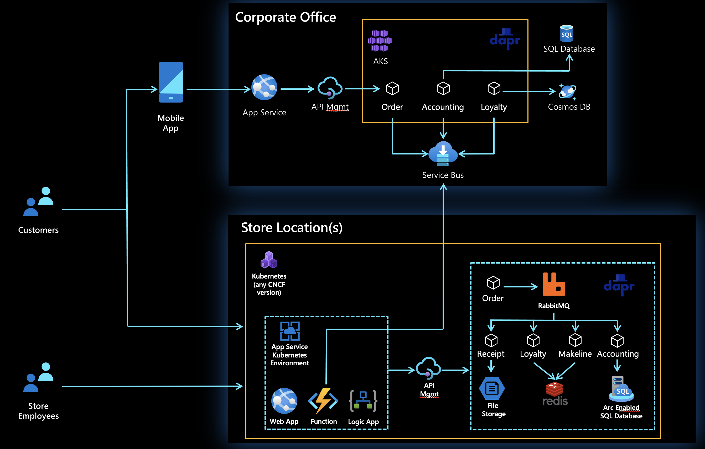

## Red Dog Retail Demo - Azure Application Innovation Scenario

### Background

This demo/workshop is being created to help show the value of the Azure App Innovation and hybrid cloud story. This includes Azure Arc for Kubernetes, Arc Enabled Services, Azure Kubernetes Service, Dapr, and the overall value of the Azure PaaS story. The application is designed with a polyglot microservices and event driven architecture. 

The business scenario is a Retail operation with applications that run in a branch office as well as Corporate. These branch stores can run in Azure or in a hybrid scenario with local compute with a connection to the cloud. If there is a loss of network connectivity, they still need to be able to process orders locally in each store. 

### Architecture Diagrams

Application Architecture

### Contents

This repo contains the scripts, manifests, docs, etc. needed to deploy and run the demo/workshop. There is a separate repo where the application source code is maintained. 

### Folder structure
| Folder      | Description                                                                                |
|------------------|-------------------------------------------------------------------------------------------------------------|
| /assets | Items relating to this readme, i.e. images, diagrams. |
| /docs | Documentation markdown.     |
| /infra   | Contains yaml and associated files for the infrastructure deployment of the resources needed to bootstrap the workshop. |
| /manifests | Manifests and charts for Arc managed configs. |
| /rest-sample | Rest services used. |

## Contributing

This project welcomes contributions and suggestions.  Most contributions require you to agree to a
Contributor License Agreement (CLA) declaring that you have the right to, and actually do, grant us
the rights to use your contribution. For details, visit https://cla.opensource.microsoft.com.

When you submit a pull request, a CLA bot will automatically determine whether you need to provide
a CLA and decorate the PR appropriately (e.g., status check, comment). Simply follow the instructions
provided by the bot. You will only need to do this once across all repos using our CLA.

This project has adopted the [Microsoft Open Source Code of Conduct](https://opensource.microsoft.com/codeofconduct/).
For more information see the [Code of Conduct FAQ](https://opensource.microsoft.com/codeofconduct/faq/) or
contact [opencode@microsoft.com](mailto:opencode@microsoft.com) with any additional questions or comments.

## Trademarks

This project may contain trademarks or logos for projects, products, or services. Authorized use of Microsoft 
trademarks or logos is subject to and must follow 
[Microsoft's Trademark & Brand Guidelines](https://www.microsoft.com/en-us/legal/intellectualproperty/trademarks/usage/general).
Use of Microsoft trademarks or logos in modified versions of this project must not cause confusion or imply Microsoft sponsorship.
Any use of third-party trademarks or logos are subject to those third-party's policies.

## Lets Begin!

Once you are ready, please begin by installing the [prerequisites](./prerequisites.md).  After that has completed, head over to the [docs](./docs) folder 
and follow the deployment instructions there to deploy the solution.

