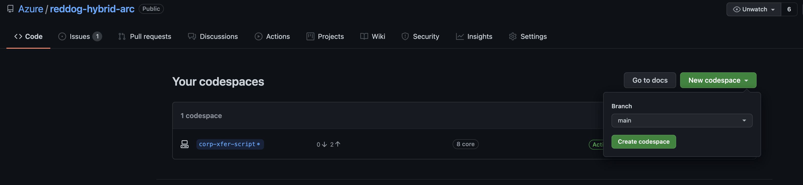
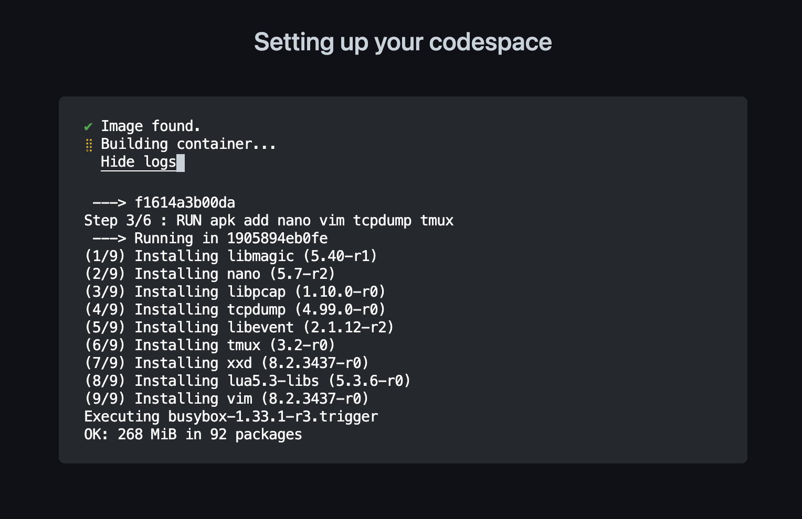

## Quickstart

This Quickstart will allow you to deploy the demo in your own Azure sub. The scripts will run in a GitHub Codespaces environment.

1. Create a new Codespace

    * Browse to the Codespaces page in the repo: https://github.com/Azure/reddog-hybrid-arc/codespaces
    * Select "New codespace"
    * On the "main" branch, select "Create codespace"

        

    * Pick a size for your Codespace environment
    * Wait for the environment to be ready
    
        

    * Once complete, you will have VS Code in your browser with the main branch cloned. You can create your own branch here if you plan to submit PR's

2. Login to Azure (in Codespace)

    * In the Codespace terminal, run Azure login:

        ```bash
        ➜  infra git:(main) az login --scope https://graph.microsoft.com//.default

        To sign in, use a web browser to open the page https://microsoft.com/devicelogin and enter the code A9X791234 to authenticate.
        ```

    * Login with your credentials and ensure the process completes

3. Configure the demo 

    * Switch to the `infra` directory
    * Make a copy of the `config.json.example` file and name it `config.json`
    * Edit the values in the new file. You must add the `subscription_id`, `tenant_id`, and pick a `rgNamePrefix`
    * If you change the `branchName`, use all lowercase, no spaces, dashes, or underscores

        ```
        {
            "subscription_id": "",
            "tenant_id": "",
            "admin_user_name": "reddogadmin",
            "rgNamePrefix": "btr123",
            
            "sql_admin_user_name": "reddogadmin",
            "sql_admin_passwd": "nJ0fqrQx7T^NZFl4sFf*U",
            
            "k3s_token": "CAa6BYPyp+6NwLY5f3or",
            "rabbit_mq_passwd": "MyPassword123",
            "redis_passwd": "MyPassword123",
            
            "hub":
            {
                "hubName":"hub",
                "location":"eastus"
            },
            "branches":[
                {
                    "branchName":"denver",
                    "location":"eastus"
                }
            ]
        }
        ```
    * Save the file

4. Run the script - "Walk the Dog" 

    The complete deployment can take 15-20 minutes. Run it and get some coffee

    ```bash
    ➜  infra git:(main) make all
    ```

    When the script completes successfully, you will see something such as: 

    ```bash
    ****************************************************
    [branch: denver] - Deployment Complete! 
    Jump box connection info: ssh reddogadmin@192.168.23.1 -i ./ssh_keys/btr123_id_rsa -p 2022
    Cluster connection info: http://192.168.23.2:8081 or http://btr123denver-k3s-worker-pub-ip.eastus.cloudapp.azure.com:8081
    ****************************************************
    ```

5. Access the demo

    * Azure RG's - browse the resources created by the script (Branch and Hub will be separate)
    * Branch Cluster (Rancher K3s) - via SSH into the Jumpbox (script outputs connection info)
    * Corp Cluster (AKS) - credentials are pulled into the Codespace environment
    * Arc config available via the Azure Portal
    * Branch UI Dashboard - URL provided in script output from above
    * Corp UI Dashboard - find App Service URL in the Hub resource group

6. What's next

    * Azure Function to move data between Branch and Corp (script in development)
    * APIM config
